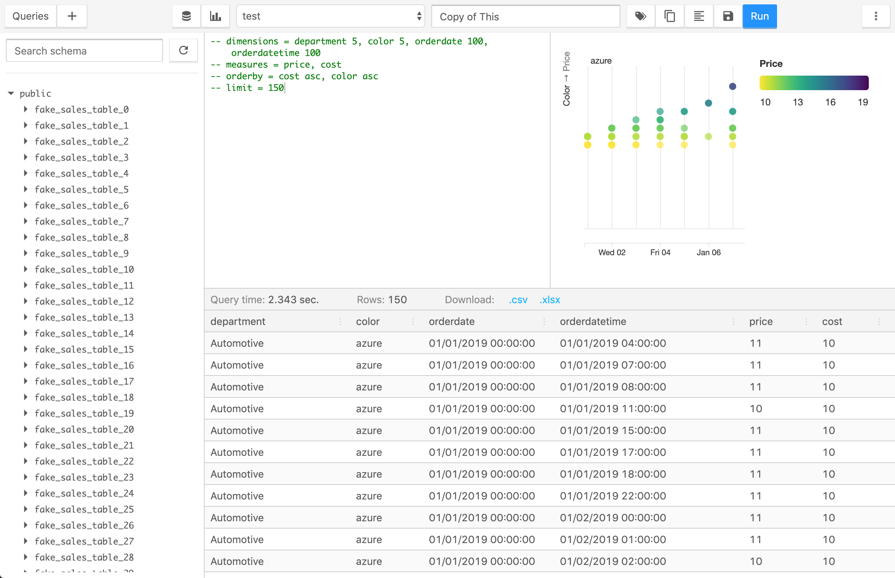
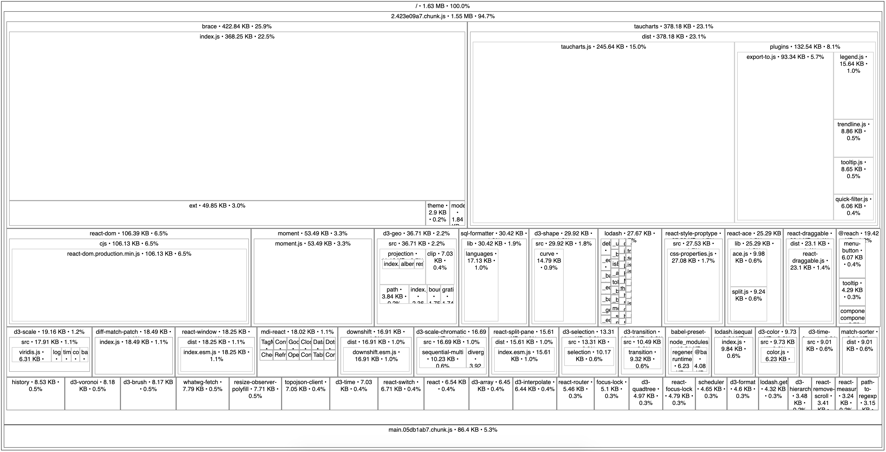

_This post is part of a series detailing the work involved to slim down SQLPad's JavaScript bundle size. [Read the introductory post](/posts/20190428-bundle-battle/)._

## First some love for antd

Before getting into this one I want to express some appreciation for [Ant Design](https://ant.design/) and antd.

antd is an amazing component library. Of the various React component libraries out there, my favorite at the moment is antd. It has a clean modern look and a nice density about it, making it a great pick for more enterprisey applications. The components were a pleasure to work with.

And there are so many components. [Cascading selections](https://ant.design/components/cascader/) and [steps](https://ant.design/components/steps/) and [AutoCompletes](https://ant.design/components/auto-complete/) and [mentions](https://ant.design/components/mention/) and [selects with tag modes](https://ant.design/components/select/) and [a calendar](https://ant.design/components/calendar/) and [trees](https://ant.design/components/tree/) and [timelines](https://ant.design/components/timeline/) and [drawers](https://ant.design/components/drawer/) and my favorite [modals that animate open from the click location](https://ant.design/components/modal/).

If you need a component, antd probably has it.

Unfortunately all that comes with the cost of a larger JavaScript bundle.

When I set out to update SQLPad's UI, I initially decided on antd because I wanted a library that had everything. I wanted the design to be cohesive, and I wanted it to be easy for others to expand on the UI if necessary. Instead of dealing with a random assortment of components I built, someone could simply take from the component library of antd.

I think that's a great benefit for a project, but I'm not sure if it is worth the cost for SQLPad.

I ended up building my own tree and table components, and the other main component experiences are a code editor and a charting library which are also not from antd. (I realize how this does not fit with the paragraph above saying antd has everything you need.)

I should have maybe thought about this a bit more before taking on a UI component conversion, but my component needs are pretty basic. Buttons, inputs, modals, toasts, and some tabs... I'm set. I don't need a lot of the fancy antd components listed above. For those I do need, I can expand on some primitive react UI libraries like [Reach UI](https://ui.reach.tech/) and [downshift](https://github.com/downshift-js/downshift) and still keep the bundle small.

## Removing antd

This was difficult work to push through because I spent a long time refactoring the previous solution and altering the design of SQLPad to fit to antd components. If it weren't for the self challenge to shrink the JS bundle I would not have put myself through this. On the upside, all that refactoring to antd helped make the transition off it easier. I have a better understanding of React now than I did 3 years ago.

antd uses old-fashioned CSS to style its components. I decided to copy the pieces of style I like for components like buttons and inputs and use that as a base style to build on. With CSS module support in create-react-app 2+ I figured I'd give css modules a shot too.

And now for some random thoughts on how things went.

### Buttons

Buttons were the first to convert. I started out wrapping a regular html button with some css and logic around when to use what class. The CSS ripped from antd and lightly modified.

Its initial component implementation looked like this.

```jsx
import React from "react";
import styles from "./Button.module.css";

export default function Button({ children, type, className, ...rest }) {
  const classNames = [styles.btn];

  if (type === "primary") {
    classNames.push(styles.primary);
  } else if (type === "danger") {
    classNames.push(styles.danger);
  }

  if (className) {
    classNames.push(className);
  }

  return (
    <button className={classNames.join(" ")} {...rest}>
      {children}
    </button>
  );
}
```

Easy!

Or is it? It wasn't long until I started having a lot of styles copied across components (primary/danger styles for example). Then with the introduction of reach tooltip, I ran into smaller nuanced edge cases that needed to be addressed.

The Reach tooltip component passes on a ref to its child component for positioning, but since I am using functional components this means I had to wrap my component function in `React.forwardRef`. Then using the application teased out issues with tooltips on hover of disabled buttons. A quick googling brought me to an [explanation of why by Bootstrap](https://getbootstrap.com/docs/4.0/components/tooltips/#disabled-elements)

Instead of getting hover tooltips on disabled buttons I just opted to not show the tooltip. Handling this case influenced my component API though in ways I haven't given much thought to in the past though. Up until this point I was using my Tooltip and Button components separately:

```jsx
<Tooltip label="helpful tip">
  <Button disabled={disabled}>my button</Button>
</Tooltip>
```

This worked well for ad-hoc building of things but there's no way I was going to do this everywhere there was a disabled button:

```jsx
{
  disabled ? (
    <Button disabled>my button</Button>
  ) : (
    <Tooltip label="helpful tip">
      <Button>my button</Button>
    </Tooltip>
  );
}
```

So instead I opted to add a tooltip prop to the `Button` component and have it own its tooltip. This comes at the expense of losing the ability to tweak tooltip styles or other properties outside the `Button` component, but that's something I'm okay with, because the application owns the button implementation now, not a component library.

```jsx
<Button disabled={disabled} tooltip="helpful tip">
  my button
</Button>
```

In addition to tooltip considerations, icons also needed to be considered.

To get to the point of all this... The simplest of all components gradually grew to something more complex. And I'm sure it'll continue to grow in complexity.

```jsx
import React from "react";
import styles from "./Button.module.css";
import Tooltip from "./Tooltip";

const ICON_SIZE = 18;

const Button = React.forwardRef(
  (
    { children, icon, type, htmlType, tooltip, disabled, className, ...rest },
    ref
  ) => {
    const classNames = [styles.btn];

    if (type === "primary") {
      classNames.push(styles.primary);
    } else if (type === "danger") {
      classNames.push(styles.danger);
    }

    if (className) {
      classNames.push(className);
    }

    const button = (
      <button
        ref={ref}
        className={classNames.join(" ")}
        type={htmlType}
        disabled={disabled}
        {...rest}
      >
        {icon && React.cloneElement(icon, { size: ICON_SIZE }, null)}
        {children && icon && <span style={{ width: 4 }} />}
        {children}
      </button>
    );

    // If the button is disabled the tooltip gets weird on hover
    if (!tooltip || disabled) {
      return button;
    }

    return <Tooltip label={tooltip}>{button}</Tooltip>;
  }
);

export default Button;
```

### Select

For the Select component I've opted to just use the standard HTML select element, and deal with its limitations. [Mozilla kindly points out that the select element is notorously difficult to style](https://developer.mozilla.org/en-US/docs/Web/HTML/Element/select#Styling_with_CSS).

I always thought the style was in regards to the options, but it turns out you also can't change the border radius? Really?!?

Not much I wanted to say here other than you don't know what you can't style until you try.

### Modals/dialogs, tooltips, and menus

For the components that don't have native browser equivalents, I opted to go with those offered by [ReachUI](https://ui.reach.tech/).

The library aims to provide an accessible foundation for components which is great. The main draw for me though is that the components themselves are very basic and not styled much. They are also lightweight. Exactly the kind of component library I need for this exercise!

Something I didn't quite expect from the focus on accessibility? Really pleasant keyboard navigation throughout the application. Modals open and set focus to the first focusable element or the component of your choice. Escape key closes it. Tooltips show when tabbing through components. It's great.

### Toast messages

Something antd had that I really liked (and overused) was the ability to easily create a toast/notification message imperatively. Instead of setting an error state somewhere and then rendering an error component in response to that state (and then unsetting that state after some time), you interact with an API that does all that for you somewhere near the top of your app by calling a function `message.error('something happened');`

You could recreate this with redux or context or something similar, but I opted to use a simple event emitter pub/sub called [mitt](https://github.com/developit/mitt).

Since it is not stored or context based, there's no importing of context reference or connecting the component to actions to use it. Simply import the message function and call it.

The [implementation](https://github.com/rickbergfalk/sqlpad/blob/master/client/src/common/message.js) is really basic and naive, but it works. It has me thinking as to why we (developers using React) don't use more of event pub/sub outside of React.

### Tag select/auto complete

For building my own tag input, I opted to use [downshift](https://github.com/downshift-js/downshift) because it's a primitive for building these kinds of inputs where you want some auto complete and is fairly popular.

I'm thankful this library exists and that there are so many examples... but is it possible for a React primitive to be too primitive?

Reading through the examples and trying to build something was not only difficult, but resulted in code that (in my opinion) is hard to follow.

Ultimately I'd like perhaps something between [react-select](https://github.com/JedWatson/react-select) and downshift.

Or I don't know maybe it's fine. It was about this point I wanted this to be over with.

### Application styles (I can do whatever I want I'm an adult)

Something exciting and new that has come out of all this is the ability to make SQLPad feel like my own. While I used antd as a starting point, some things have changed to make it not at all like antd.

Buttons are a bit more square and raised. Inputs have an inset shadow. I introduced a lot of magenta. Maybe too much. I don't know if this will stick around for the v3 release, but it is kind of nice to have something new and unique... right? (I was listening to a lot of synthwave while doing this work and I think I want the aesthetic in the app?)




## Closing thoughts

- HTML/CSS has gotten better over the years, but there are still some wacky parts and missing element primitives you'd think exist by now.
- I definitely hit a point where I just want this work to be over with. And that's kind of a sad feeling to have towards something you've created.
- The bundle size is definitely smaller though!!!

```
              bundle  ~2.58 MB
-               antd
+      @reach/dialog
+ @reach/menu-button
+     @reach/tooltip
+          downshift
+       match-sorter
+          mdi-react
+               mitt
+       react-switch
-------------------------------
          new bundle  ~1.63 MB
```


