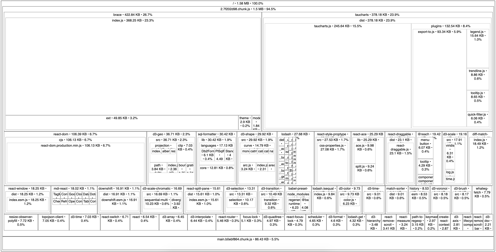

_This post is part of a series detailing the work involved to slim down SQLPad's JavaScript bundle size. [Read the introductory post](/posts/20190428-bundle-battle/)._

## Momentjs is 50 KB

And [I was only using it for 1 function call](https://github.com/rickbergfalk/sqlpad/pull/430/files#diff-486a99fac215e1e194438ff89b218c15L16), which was easily replaced with just regular JavaScript.

At one point I was doing a that whole "query was updated 2 days ago" type text but since got rid of it. And really if that comes back I can just determine that server side and send the string down to the browser.

```
              bundle  ~1.63 MB
-             moment
-------------------------------
          new bundle  ~1.58 MB
```


